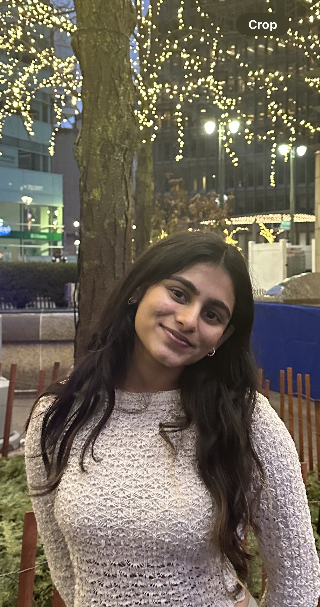

    

## Education
- Michigan State University - East Lansing, MI                                                 (May 2026)
- Bachelor of Science in Computer Science Engineering
- Awards/Honors: Dean’s List, Presidential Scholar Scholarship, International Tuition Grant. 

## Skills 

- Languages : Python,C++,Java,HTML,SQL
- Libraries : Pandas,Tkinter
- Foreign languages : English,German,Telugu,Hindi and Kannada

## Involvement

- Phi sigma Rho - Alpha Delta Chapter (Sophomore Standards Board)

  - A social sorority for Women in engineering and engineering tech. We empower and support women     pursuing careers in engineering or related majors.Represent sophomore class for social sorority of women in engineering and engineering technology related majors when meeting weekly with standards board, discuss and vote on bylaws, meet with sisters with concerns and status changes.

- Women in Computing: 
  - Empowering women in IT, the club aims to foster diversity and provide opportunities for growth and mentorship in the IT field.

